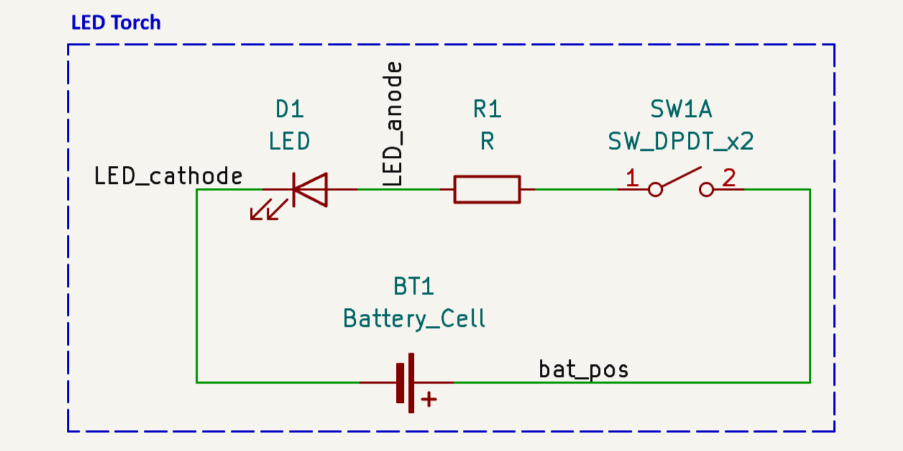
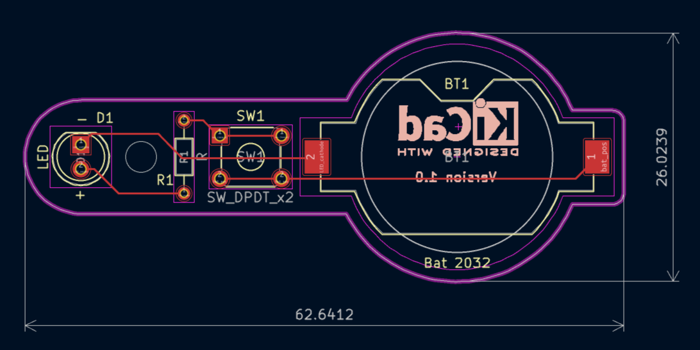
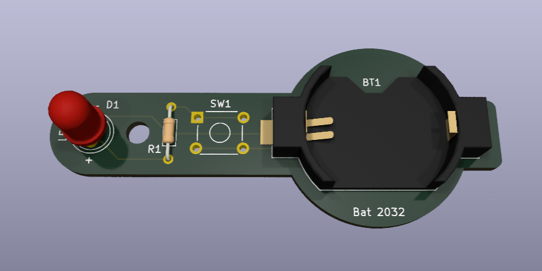
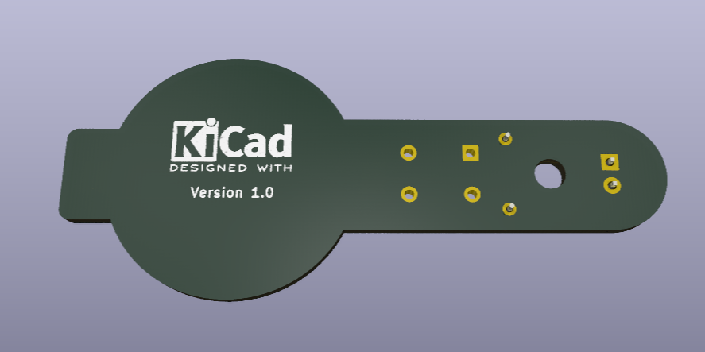

# Simple Led Torch
It is a simple led torch as my first project in KiCad with a unique PCB layout.

## Skills
KiCad (Eeschema, PcbNew, GerberViewer, Spice Simulation)

## My Circuits

  
  

### 3d View

  
  

## Created By

- [@agonix007](https://www.github.com/agonix007)